# Hệ thống OCR và Review dữ liệu hợp đồng thế chấp - Giai Ä‘oạn 1

Giai đoạn 1 chỉ xử lý: nhận Google Form, upload hồ sơ, OCR, bóc tách dữ liệu bằng AI, kiểm tra thiếu/mâu thuẫn/cảnh báo, gửi link Review, cho sửa thủ công, xác nhận và lưu dữ liệu sạch. Chưa sinh hợp đồng Word/PDF.

## 1. Kiến trúc tổng thể

Các thành phần:

- Google Form: nơi người dùng nhập thông tin ban đầu và upload hồ sơ.
- Google Sheets: database vận hành gồm RESPONSES, CASES, OCR_RESULTS, EXTRACTED_DATA, REVIEW_OVERRIDES, FINAL_DATA, AUDIT_LOGS.
- Google Drive: lưu hồ sơ upload, text OCR, JSON AI, JSON review, JSON final và log.
- Apps Script trigger `onFormSubmit`: điều phối toàn bộ pipeline sau khi submit form.
- OCR service: mặc định dùng Google Drive OCR qua Advanced Drive Service; có tùy chọn Cloud Vision OCR cho ảnh.
- OpenAI API: bóc tách OCR text thành JSON cấu trúc. Code dùng Responses API với Structured Outputs JSON schema theo tài liệu OpenAI.
- Apps Script Web App: màn hình Review có token bảo mật.
- MailApp: gá»­i link Review.

## 2. Workflow

```mermaid
flowchart TD
  A["Người dùng submit Google Form"] --> B["Apps Script onFormSubmit"]
  B --> C["Tạo mã hồ sơ và folder Drive"]
  C --> D["Copy file upload vào 01_Uploaded_Files"]
  D --> E["OCR từng file"]
  E --> F["Lưu OCR_RESULTS và 02_OCR_Text"]
  F --> G["Gọi OpenAI extraction"]
  G --> H["Merge dữ liệu theo ưu tiên"]
  H --> I["Validate missing/conflicts/warnings"]
  I --> J["Lưu EXTRACTED_DATA và 04_Review_Data"]
  J --> K["Gửi email link Review có token"]
  K --> L["Người dùng mở Web App Review"]
  L --> M["Sửa từng field nếu cần"]
  M --> N["Lưu REVIEW_OVERRIDES và audit log"]
  L --> O["Xác nhận dữ liệu"]
  O --> P["Lưu FINAL_DATA và 05_Final_Data JSON"]
```



## 3. Cấu trúc Google Sheet

- `RESPONSES`: Timestamp, Case ID, Review Email, Sender Name, Sender Phone, Asset Type, Contract Type, Asset Count, Bank Signer, Dispute Court, Valuation Amount, Manual Merged Address, Notes, Raw Form JSON.
- `CASES`: Case ID, Review Email, Status, Drive Folder URL, Review URL, Review Token Hash, Created At, OCR Done At, Email Sent At, Review Confirmed At, Last Error.
- `OCR_RESULTS`: Case ID, File Name, File ID, File Type, OCR Text, OCR Status, Confidence, OCR Text File URL, Created At.
- `EXTRACTED_DATA`: Case ID, JSON Data, Validation Status, Missing Fields, Conflicts, Warnings, AI JSON File URL, Created At.
- `REVIEW_OVERRIDES`: Case ID, Field Path, Field Label, Old Value, New Value, Edited By, Edited At, Reason.
- `FINAL_DATA`: Case ID, Final JSON, Review Status, Confirmed By, Confirmed At, Final JSON File URL.
- `AUDIT_LOGS`: Case ID, Action, Detail, User, Timestamp.

Chạy hàm `setupSpreadsheet()` một lần để tạo các sheet và header.

## 4. Cấu trúc Google Drive

Với mỗi hồ sơ:

```text
/Hop_dong_the_chap/
  /{{MA_HO_SO}}_{{TEN_NGUOI_GUI}}/
    /01_Uploaded_Files/
    /02_OCR_Text/
    /03_AI_JSON/
    /04_Review_Data/
    /05_Final_Data/
    /06_Logs/
    /07_Contract_Output/
```

`07_Contract_Output` được tạo sẵn cho giai đoạn 2 nhưng chưa dùng ở giai đoạn 1.

## 5. JSON schema dữ liệu lưu

Schema vận hành chính nằm trong `reviewJson`:

```json
{
  "schema_version": "1.0.0",
  "case_id": "HDTC-...",
  "contract_info": {
    "contract_type": {
      "label": "Loại hợp đồng",
      "ai_value": "",
      "form_value": "",
      "manual_value": "",
      "final_value": "",
      "source": "FORM",
      "confidence": "",
      "confirmed": false
    }
  },
  "secured_parties": [],
  "obligors": [],
  "assets": [],
  "ocr_results": [],
  "validation": {
    "status": "OK|HAS_ISSUES|PENDING",
    "missing_fields": [],
    "conflicts": [],
    "warnings": []
  },
  "review": {
    "status": "PENDING_REVIEW|REVIEW_CONFIRMED|REVIEW_CONFIRMED_WITH_WARNINGS",
    "review_url": "",
    "token_hash": "",
    "sent_at": "",
    "confirmed_by": "",
    "confirmed_at": ""
  },
  "manual_overrides": [],
  "audit_logs": [],
  "final_confirmed_data": {}
}
```

Mọi field quan trọng dùng object chuẩn:

```json
{
  "label": "Số CCCD",
  "ai_value": "001...",
  "form_value": "",
  "manual_value": "",
  "final_value": "001...",
  "source": "cccd_front.jpg",
  "confidence": 0.92,
  "confirmed": false
}
```

`final_confirmed_data` là phần giai đoạn 2 sẽ đọc trực tiếp. Mỗi thông tin vẫn giữ:

- `final_value`: giá trị đưa vào hợp đồng.
- `source`: MANUAL, FORM hoặc OCR_AI.
- `original_ai_value`, `form_value`, `manual_value`: phục vụ truy vết.
- `confidence`: nếu có.

## 6. Prompt AI extraction

Prompt nằm trong `Config.gs`, hàm `getAiExtractionPrompt()`. Nguyên tắc chính:

- Chỉ trả JSON theo schema.
- Không tự bịa dữ liệu.
- Không tự sửa tên người, số CCCD, số giấy chứng nhận, số thửa, số khung, số máy.
- Có căn cứ thì ghi source file và evidence.
- Mâu thuẫn đưa vào `conflicts`.
- OCR không chắc đưa vào `warnings`.
- VNeID khác CCCD thì ghi cảnh báo để người dùng xác nhận.

Schema Structured Outputs nằm trong `AIExtractionService.gs`, hàm `getExtractionJsonSchema_()`.

## 7. Các file Apps Script

- `Config.gs`: cấu hình, tên field Google Form, tên sheet, trạng thái, prompt AI.
- `FormHandler.gs`: trigger nhận submit, tạo case, gọi toàn bộ pipeline.
- `DriveService.gs`: tạo folder, copy file upload, lưu text/JSON.
- `OCRService.gs`: OCR bằng Drive OCR hoặc Cloud Vision OCR.
- `AIExtractionService.gs`: gọi OpenAI API và parse JSON.
- `DataMergeService.gs`: chuẩn hóa AI JSON, gộp người theo CCCD, ưu tiên dữ liệu form/manual, tạo `final_value`.
- `ValidationService.gs`: kiểm tra trường thiếu, mâu thuẫn, confidence thấp.
- `ReviewService.gs`: đọc dữ liệu Review, lưu sửa thủ công, xác nhận dữ liệu.
- `ReviewWebApp.gs`: endpoint Web App `doGet` và `doPost`.
- `EmailService.gs`: gá»­i email link Review.
- `AuditLogService.gs`: ghi log.
- `SheetService.gs`: tạo sheet, append/update/read.
- `Utils.gs`: tiện ích token, hash, retry, path, JSON.
- `Review.html`: giao diện Review.
- `AdminSetup.gs`: menu quản trị, tạo Form mẫu, setup Sheet/trigger và kiểm tra cấu hình.

## 8. Hướng dẫn tạo Google Form

Tạo Google Form có đúng tên câu hỏi sau để Apps Script đọc được:

1. Email người nhận link Review
2. Họ tên người gửi hồ sơ
3. Số điện thoại người gửi hồ sơ
4. Loại tài sản: Bất động sản, Động sản
5. Loại hợp đồng: Bên bảo đảm thế chấp cho chính nghĩa vụ của mình, Bên bảo đảm thế chấp cho nghĩa vụ của bên thứ ba
6. Số lượng tài sản bảo đảm
7. Người ký hợp đồng tại ngân hàng: Ông A, Ông B, Ông C, Bà D
8. Tòa án xử lý tranh chấp: Tòa khu vực A, Tòa khu vực B
9. Giá trị định giá
10. Địa chỉ mới sau sáp nhập nếu người dùng muốn nhập thủ công
11. Ghi chú bổ sung
12. Upload hồ sơ Bên bảo đảm/chủ tài sản
13. Upload hồ sơ Bên được bảo đảm
14. Upload hồ sơ tài sản

Ba câu hỏi upload phải bật cho phép nhiều file. Loại file: ảnh, PDF, Word.

Sau đó liên kết Form với Google Sheet phản hồi. Apps Script nên gắn trong Sheet phản hồi đó.

## 9. Hướng dẫn cấu hình Apps Script

1. Mở Google Sheet phản hồi.
2. Extensions > Apps Script.
3. Tạo các file `.gs` và `Review.html` tương ứng, copy nội dung từ workspace này.
4. Bật Advanced Google Services: Drive API.
5. Vào Google Cloud project liên kết Apps Script, bật Google Drive API.
6. Chạy `setupPhase1()` để tạo sheet quản lý, Google Form mẫu và trigger submit form.
7. Nếu không muốn tạo Form tự động, chạy riêng `setupSpreadsheet()` và `installFormSubmitTrigger()`.

Sau khi reload Google Sheet, menu `HDTC OCR` sẽ xuất hiện để chạy lại từng bước setup và kiểm tra cấu hình.

## 10. Cấu hình API key

Không hard-code API key trong code.

Vào Apps Script > Project Settings > Script properties:

- `OPENAI_API_KEY`: API key OpenAI.
- `OPENAI_MODEL`: model muốn dùng, ví dụ `gpt-5.4-mini`. Nếu không đặt, code dùng default trong `Config.gs`.
- `REVIEW_WEB_APP_URL`: URL Web App sau khi deploy.
- Code hiện đã có `DEFAULT_REVIEW_WEB_APP_URL` trỏ tới deployment đã tạo bằng clasp. Chỉ cần đặt `REVIEW_WEB_APP_URL` nếu bạn deploy lại và muốn ép dùng URL mới.
- `CLOUD_VISION_API_KEY`: chỉ cần nếu đổi `DEFAULT_OCR_ENGINE` sang `CLOUD_VISION`.

Ghi chú OpenAI: code dùng Responses API và `text.format.type = "json_schema"`. Theo tài liệu OpenAI, Structured Outputs giúp model trả về JSON bám schema tốt hơn JSON mode, và Responses API hỗ trợ cấu hình output text dạng JSON schema.

Nguồn tham khảo chính thức:

- [Structured Outputs](https://platform.openai.com/docs/guides/structured-outputs)
- [Responses API Reference](https://platform.openai.com/docs/api-reference/responses/create)

## 11. Deploy Web App Review

1. Apps Script > Deploy > New deployment.
2. Chọn Web app.
3. Execute as: Me.
4. Who has access: tùy chính sách nội bộ. Nếu người review ở ngoài domain, chọn Anyone with the link. Token vẫn được kiểm tra trong code.
5. Deploy và copy Web App URL.
6. Lưu URL vào Script property `REVIEW_WEB_APP_URL`.
7. Deploy lại nếu thay code.

## 12. Hướng dẫn test thử

Checklist test tối thiểu:

1. Chạy `setupSpreadsheet()` và kiểm tra đủ 7 sheet.
2. Deploy Web App, lÆ°u `REVIEW_WEB_APP_URL`.
3. Chạy `installFormSubmitTrigger()`.
4. Submit form với 1 CCCD ảnh rõ, 1 giấy chứng nhận hoặc đăng ký xe.
5. Kiểm tra `CASES` có mã hồ sơ và trạng thái `REVIEW_SENT`.
6. Kiểm tra Drive có folder đúng cấu trúc.
7. Kiểm tra `OCR_RESULTS` có OCR text.
8. Kiểm tra `EXTRACTED_DATA` có JSON.
9. Mở email Review.
10. Sửa một field, kiểm tra `REVIEW_OVERRIDES` và `AUDIT_LOGS`.
11. Bấm xác nhận dữ liệu, kiểm tra `FINAL_DATA` và file JSON trong `05_Final_Data`.
12. Kiểm tra link sai token không truy cập được.

## 13. Lỗi thường gặp và cách sửa

- `Missing script property OPENAI_API_KEY`: thêm API key vào Script properties.
- `Missing review URL`: deploy Web App và lưu `REVIEW_WEB_APP_URL`.
- `Drive is not defined`: bật Advanced Google Services > Drive API và bật Google Drive API trong Google Cloud project.
- OCR PDF/ảnh rỗng: file scan quá mờ, bị xoay, hoặc Drive OCR không đọc tốt; thử Cloud Vision OCR cho ảnh.
- Không nhận file upload: tên câu hỏi Google Form không khớp `CONFIG.FORM_FIELDS`.
- Email không gửi: kiểm tra quyền MailApp, quota Gmail/Apps Script, email nhận có hợp lệ không.
- Web App báo token sai: link bị copy thiếu query `caseId` hoặc `token`, hoặc đã đổi row `Review Token Hash`.
- OpenAI trả lỗi schema/model: đổi `OPENAI_MODEL` sang model hỗ trợ Structured Outputs hoặc dùng schema ít nghiêm ngặt hơn.
- Review xác nhận nhưng vẫn có cảnh báo: nếu còn `missing_fields` hoặc `conflicts` và người dùng xác nhận tiếp, trạng thái sẽ là `REVIEW_CONFIRMED_WITH_WARNINGS`.

## 14. Quy tắc ưu tiên dữ liệu đã triển khai

Thứ tự ưu tiên khi tạo `final_value`:

1. `manual_value` từ màn hình Review.
2. `form_value` từ Google Form.
3. `ai_value` từ OCR/AI.
4. Nếu không có dữ liệu thì để trống và đưa vào validation nếu là field quan trọng.

OCR gốc luôn được giữ trong `OCR_RESULTS` và file text trong Drive. Sửa thủ công chỉ ghi thêm vào `REVIEW_OVERRIDES`.

## 15. Phần để sang giai đoạn 2

Các phần sau chưa làm trong giai đoạn 1:

- Map `final_confirmed_data` vào mẫu hợp đồng Word/Google Docs.
- Thay placeholder trong mẫu hợp đồng.
- Sinh file Word/PDF.
- Lưu hợp đồng đầu ra vào `07_Contract_Output`.
- Gửi hợp đồng đã sinh cho người dùng/ngân hàng.


